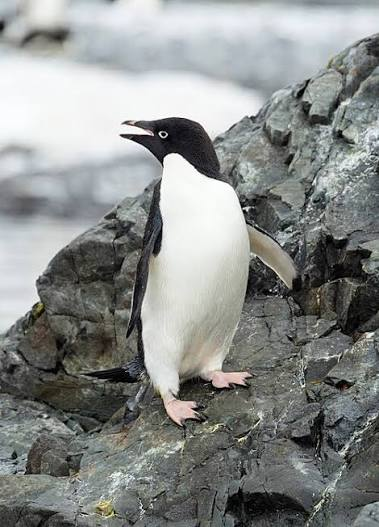
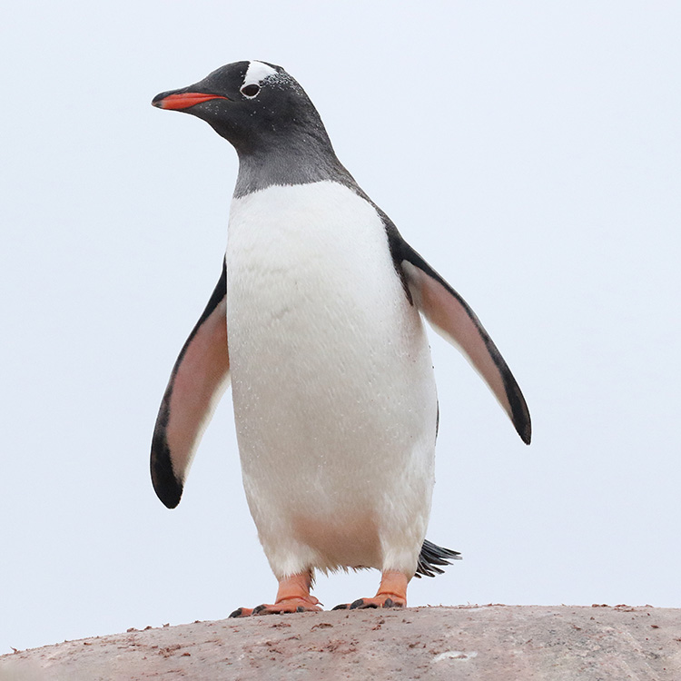
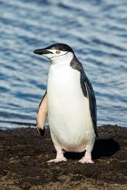

## Penguins

Our topic looked at the Palmer Penguins dataset (Horst et al., 2020):

-   Covers 3 penguin species: Adelie (73 female 73 male & 6 unknown), Gentoo (58 female, 61 male & 5 unknown), Chinstrap (34 female and 34 male)

-   Dataset contains 344 penguins with each recording species, island, flipper length, bill depth, body mass, an sex

-   Sourced from 3 islands in the Palmer Archipelago - Biscoe, Dream and Torgersen

## The Species

::: {layout-ncol="3"}


{width="658"}

{width="319"}
:::

## Question

Sex is not species. Within a single species, males and females differ substantially in body size; often enough that a male penguin of one species can be closer in size to a female of another.

Investigate whether this is actually happening in the data: does adding or removing sex from your analysis change which individuals get misclassified?

## Hypothesis

1\) Penguin sex differences within species can cause overlap between species?

2\) Does accounting for penguin sex cause a difference in misclassification?

## Intro

\[insert Intro\]

## Methods

\[Insert Methods\]

## Methods - Models

<!-- Analysed and cleaned the data for consistency -->

-   Removed rows of penguins where sex was missing - 11 individuals

<!-- -->

-   Added row_id colunn to examine individuals

```{r}
#| echo: false
#| eval: true
palmer_penguins <- read.csv("penguins_cleaned.csv")
palmer_penguins$row_id <- 1:nrow(palmer_penguins)
palmer_penguins$species <- as.factor(palmer_penguins$species)
palmer_penguins$sex <- as.factor(palmer_penguins$sex)
```

```{r}
#| echo: true
#| eval: true
head(palmer_penguins)
```

## Methods (cont'd)

<!-- what we ran and what it gives us (why saved for questions) -->

For Adelie, Gentoo and Chinstrap, and each of the 4 measurements (bill length, bill depth, flipper length, body mass):

1.  F-test - do males and females have equal variance?

2.  T-test - do males and females have different means?

3.  Hotelling's T² - do means differ when all 4 measurements are grouped together?

4.  Box's M - do males and females have the same covariance/spread?

## Results

(Person 2 results\]

## Results - Part 1: f-test (equal variances)

| Species   | Measurement    | p-value |
|-----------|----------------|---------|
| Adelie    | Body mass      | 0.034   |
| Gentoo    | Bill length    | 0.033   |
| Gentoo    | Bill depth     | 0.017   |
| Gentoo    | Flipper length | 0.005   |
| Chinstrap | Bill length    | 0.0002  |

-   f-tests were used to check if males and females for each species had equal variances, which then determined whether the t-tests used var.equal = TRUE or FALSE.

<!-- 7 OF THE 12 SPECIES X MEASUREMENT COMBINATIONS had equal variances. Table shows the species and measurements with INEQUAL VARIANCES with p value < 0.05. -->

## Results - Part 1: t-test & Hotelling's T²

| Species   | All 4 t-tests | Hotelling's T² p-value |
|-----------|---------------|------------------------|
| Adelie    | p \< 0.05     | ≈ 0                    |
| Gentoo    | p \< 0.05     | ≈ 0                    |
| Chinstrap | p \< 0.05     | 3.19 × 10⁻¹³           |

-   Per the results table, measurements for each species have a significant difference when looking at sex

    <!-- both as a single measurement with t-test and when analysed jointly with hotelling's). We can see this from the p-value all satisfy a p-value of < 0.05 -->

## Results - Part 1: Box's M (covariance shape)

| Species   | p-value | Significant at α=0.05? |
|-----------|---------|------------------------|
| Adelie    | 0.061   | No                     |
| Gentoo    | 0.0035  | Yes                    |
| Chinstrap | 0.0065  | Yes                    |

-   Gentoo and Chinstrap male and female penguins differ not only in their size but also covariance structure.

-   Adelie males and females have a more similar covariance structure <!-- meaning they vary in a more similar way to each other -->

<!-- note that for Adelie is above our p value but not super high-->

## Results - Part 2: Classification Model

We used multivariate Gaussian model <!-- (with mean vector μ + covariance Σ) --> to each group, and classified penguins using the Mahalanobis distance: <!-- against each species: -->

```{r}
#| echo: false
#| eval: true


#Adelie
mean.adelie <- colMeans(subset(palmer_penguins, species=="Adelie")[, 3:6])
mean.adelie
covariance.adelie <- var(subset(palmer_penguins, species=="Adelie")[, 3:6])
covariance.adelie

#Gentoo
mean.gentoo   <- colMeans(subset(palmer_penguins, species=="Gentoo")[, 3:6])
mean.gentoo
covariance.gentoo <- var(subset(palmer_penguins, species=="Gentoo")[, 3:6])
covariance.gentoo

#Chinstrap
mean.chinstrap   <- colMeans(subset(palmer_penguins, species=="Chinstrap")[, 3:6])
mean.chinstrap
covariance.chinstrap <- var(subset(palmer_penguins, species=="Chinstrap")[, 3:6])
covariance.chinstrap

```

## Results - Part 2: Classification Model

```{r}
#| echo: true
#| eval: true

library(biotools)
boxM(palmer_penguins[, 3:6], palmer_penguins$species)

```

A Box's M test confirmed that our three species have significantly different covariance shapes (p = 3.02 × 10⁻⁸), justifying separate Σ per species rather than one shared/pooled matrix.

Then proceeded with the Mahalanobis distance again based on the Box M test results.

```{r}
#| echo: true
#| eval: true
d1.adelie    <- mahalanobis(palmer_penguins[, 3:6], center = mean.adelie,    cov = covariance.adelie)
d2.gentoo    <- mahalanobis(palmer_penguins[, 3:6], center = mean.gentoo,    cov = covariance.gentoo)
d3.chinstrap <- mahalanobis(palmer_penguins[, 3:6], center = mean.chinstrap, cov = covariance.chinstrap)

combined <- cbind(d1.adelie, d2.gentoo, d3.chinstrap)
species_labels <- c("Adelie", "Gentoo", "Chinstrap")
combined_df <- species_labels[apply(combined, 1, which.min)]
```

## Results - Part 2: Classification Model II

We repeated our model but now accounting for the sex within each species. <!-- computing mean and covariance to calculate Mahalanbobis for male vs female of each species: -->

Example of the Adelie R code:

```{r}
#| echo: true
#| eval: true

#adelie

mean.adelie.m <- colMeans(subset(palmer_penguins, species=="Adelie" & sex=="male")[, 3:6]) 
covariance.adelie.m <- var(subset(palmer_penguins, species=="Adelie" & sex=="male")[, 3:6])

mean.adelie.f <- colMeans(subset(palmer_penguins, species=="Adelie" & sex=="female")[, 3:6]) 
covariance.adelie.f <- var(subset(palmer_penguins, species=="Adelie" & sex=="female")[, 3:6])

d1m.adelie <- mahalanobis(palmer_penguins[, 3:6], center = mean.adelie.m, cov = covariance.adelie.m) 

d1f.adelie <- mahalanobis(palmer_penguins[, 3:6], center = mean.adelie.f, cov = covariance.adelie.f)
```

## Results - Part 2: Comparing Models

-   Model without sex distinction - (species only with 3 centroids)

-   Model with sex distinction - (species and sex with 6 centroids)

| Model                   | Misclassified Penguins |
|-------------------------|------------------------|
| Without sex distinction | 4                      |
| With sex distinction    | 1                      |

<!-- 4 penguins misclassified under the first model and 1 misclassified under the second model. There was no overlap of the same misclassified penguins between models -->

## Results - Part 2: Misclassified Penguins

| Row ID | True species | Sex | Model without Sex Distinction | Model with Sex Distinction |
|---------------|---------------|---------------|---------------|---------------|
| 68 | Adelie | male | Chinstrap | Adelie |
| 124 | Adelie | male | Chinstrap | Adelie |
| 286 | Chinstrap | female | Adelie | Chinstrap |
| 296 | Chinstrap | female | Adelie | Chinstrap |
| *274* | *Chinstrap* | *female* | *Chinstrap* | *Adelie* |

<!-- here are specific details about these individuals 68, 124, 286, 296 and 274-->

## Penguins 68 and 124

Adelie males with larger bill and flipper measurements than average.

-   Without sex: compared these individuals to a combined sex Adelie centroid, hence they ended up looking closer to Chinstrap

    <!--  This is because the measurements from smaller females in the combined-sex centroid brought the average down and further away from these penguins -->

-   With sex: able to be compared to the Adelie-male centroid specifically, lead to a correct match

    <!-- as no longer affected by the female Adelie measurements -->

## Penguins 286 and 296

Chinstrap females with shorter flipper length than typical.

<!-- (296 also lower mass, shallower bill)  -->

-   Without sex: pulled toward the combined-sex Adelie centroid
-   With sex: correctly matched to the Chinstrap-female centroid

## Penguin 274

A female Chinstrap, correctly classified under the model without sex but misclassified once sex was added to the model.

-   Bill length is inline with the Chinstrap female average

-   Body mass and bill depth is larger than the Chinstrap female average

    <!-- bringing it toward the Adelie-male group instead of the sex-specific Chinstrap-female group -->

**A model that accounts for sex seems to be more accurate overall, but can be more sensitive to some individuals with more atypical measurements.**

## Conclusion

-   Male and female penguins have a significant size difference across all 3 species (Adelie, Gentoo and Chinstrap) (Part 1)

-   This size variation is significant enough to cause misclassification when sex is not accounted for (Part 2)

-   Accounting for sex corrected 4 misclassified penguins but also introduced 1 new misclassification

-   Yes! Adding or removing sex changes which individuals get misclassified, supporting the hypothesis that within-species size overlap can cause cross-species misclassification

## Limitations

-   Our models and analysis used the same limited sample data set

    <!-- and therefore, our results may not be consistent with results from a new sample of the population.-->

-   We note we did not run the model for the 11 penguins with unconfirmed sex - possible future direction to determine whether sex can be determined based on measurements when sex is unknown

## References

\- Horst, A. M., Hill, A. P., & Gorman, K. B. (2020). \*palmerpenguins: Palmer Archipelago (Antarctica) penguin data\* \[R package\]. https://doi.org/10.5281/zenodo.3960218

- Frery, A. C. (2026). \*Mahalanobis Distance, Robustness, and Algorithms\* \[Lecture slides\]. STAT394, Victoria University of Wellington.
